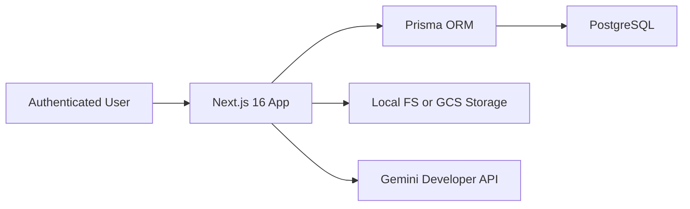

# Architecture

AETHER-PQC is a server-rendered Next.js 16 application with co-located server actions for user workflows and a deterministic-first ingestion pipeline.

## System Context

## Runtime Flow

1. User authenticates through Auth.js Google OAuth.
2. User creates a project.
3. User uploads artifacts through the scan console.
4. The server stores the original artifact through the storage adapter.
5. Deterministic parsing extracts known crypto material from structured JSON or text.
6. Gemini Developer API handles images, scanned PDFs, screenshots, diagrams, and ambiguous content.
7. Extracted graph data is validated, merged, and persisted in PostgreSQL.
8. Remediation records are generated and displayed as a migration queue.

## Trust Boundaries

- Browser input is untrusted.
- Uploaded files are validated for size and supported type before storage.
- Artifact parsing and Gemini calls run only server-side.
- Project access is checked by `userId` on server boundaries.
- Secrets are read from environment variables and must never be exposed to client components.

## Storage

Local development uses filesystem storage. Production-oriented Terraform provisions a GCS bucket, and the app switches to it with `STORAGE_DRIVER=gcs`.

## Database

PostgreSQL stores Auth.js entities, projects, artifacts, scan events, graph snapshots, and remediation plans. Prisma owns the schema and migrations.
