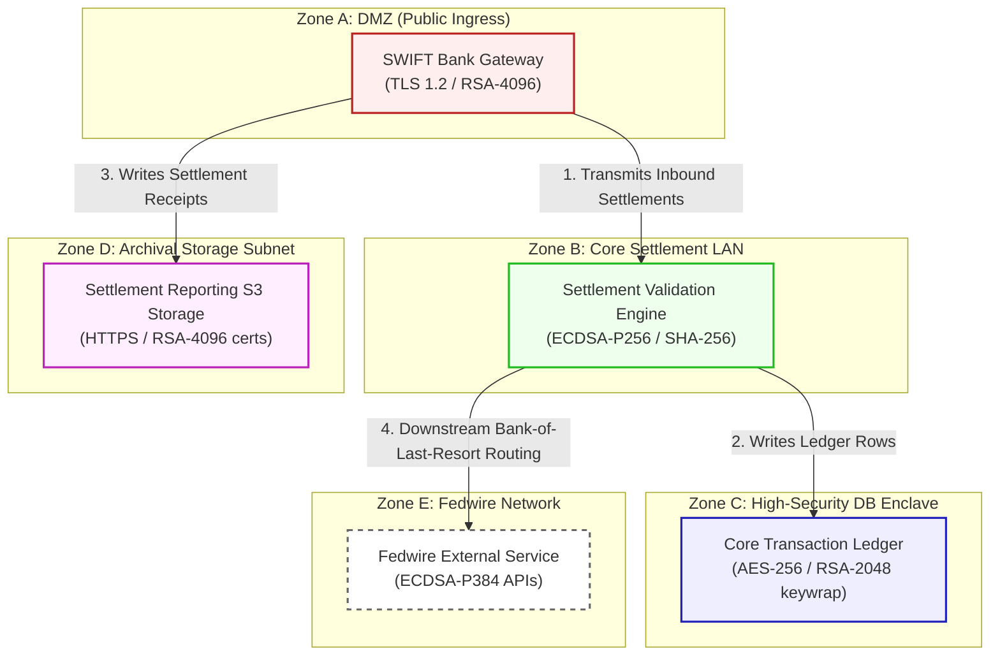

# ApexTransact Core Architecture & Network Flow Diagram

This document registers the network topology, trust boundaries, and transactional flow for **ApexTransact (Scenario 06)**.

---

## 1. Network Zones & Trust Boundaries

The estate is partitioned into four distinct cryptographic trust zones to isolate transactional data and authorize ingress:
* **Zone A: Demilitarized Zone (DMZ)**: Public-facing gateway terminating external banking channels (SWIFT).
* **Zone B: Core Settlement LAN**: Isolated backend network running validation processors.
* **Zone C: High-Security Database Enclave**: Highly restricted server zone hosting Oracle DB clusters.
* **Zone D: Archival Storage Subnet**: File storage infrastructure retaining transactional reports.

---

## 2. Detailed Architecture Flow Diagram

The following Mermaid flowchart tracks how financial clearing messages flow through the trust boundaries and lists current vulnerable cryptographic controls:

---

## 3. Cryptographic Data Flow Narrative

1. **Inbound Ingress**: Commercial bank members transmit ISO clearing documents via the **SWIFT Bank Gateway**. Connections terminate at the gateway using **TLS 1.2** with ECDHE-RSA ciphers.
2. **Ledger Validation**: The gateway forwards valid transactions to the **Settlement Validation Engine**, which signs and verifies transactions using **ECDSA-P256** signatures to ensure non-repudiation.
3. **Database Write**: Authorized settlement transactions are recorded in the **Core Transaction Ledger**, which encrypts records at rest using **AES-256** with key transport wrapped via classical **RSA-2048**.
4. **Audit Preservation**: Signed receipt documents are archived in the **Settlement Reporting S3 Storage** over HTTPS connections using classical **RSA-4096** web ciphers, exposing transaction summaries to HNDL threats.
5. **Reserve Adjustments**: The engine routes downstream transactions to the **Fedwire External Service** via REST APIs utilizing standard **ECDSA-P384** signatures.
