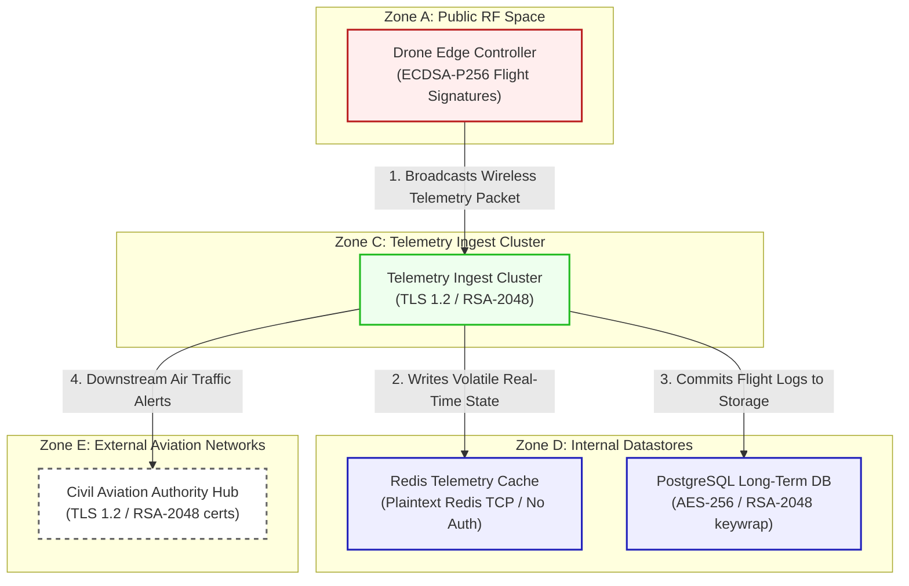

# AeroMesh Command Architecture And Security Specification

Fictional product: **AeroMesh Command**
Deployment model: **hybrid fleet telemetry**
Scenario purpose: autonomous fleet command and telemetry system

This document registers the network topology, trust boundaries, and transactional flow for **AeroControl (Scenario 07)**.

---

## 1. Network Zones & Trust Boundaries

The system spans five operational zones with distinct threat parameters:
* **Zone A: Public RF Space**: Wireless telemetry paths over commercial RF bands.
* **Zone B: Drone Edge Controller**: Embedded flight-controller operating in real time.
* **Zone C: Telemetry Ingestion Cluster**: Backend cloud environment running parser instances.
* **Zone D: Internal Datastore Zone**: High-speed memory caches and historical DB instances.
* **Zone E: External Aviation Interfaces**: Integrations with regional civil aviation flight databases.

---

## 2. Detailed Architecture Flow Diagram

The following Mermaid flowchart tracks how telemetry messages flow through the trust boundaries and lists current vulnerable cryptographic controls:

---

## 3. Cryptographic Data Flow Narrative

1. **Edge Broadcast**: The **Drone Edge Controller** generates telemetry updates containing coordinates, velocity, and battery levels, signing them via **ECDSA-P256** signatures to ensure non-repudiation.
2. **Ingestion Intake**: The package is received over cellular channels by the **Telemetry Ingest Cluster** via HTTPS REST endpoints using standard **TLS 1.2** with RSA-2048 web certificates.
3. **Cache Storage**: Volatile, real-time drone states are written immediately into the **Redis Telemetry Cache** over plaintext Redis TCP links with no internal cryptographic authentication, creating high internal sniffing exposure.
4. **Permanent Logging**: Historical flight metrics are committed to the **PostgreSQL Long-Term DB**, which utilizes **AES-256** transparent table storage with key transport wrapped via classical **RSA-2048**.
5. **Aviation Integration**: Real-time altitude updates are routed to the **Civil Aviation Authority Hub** via REST API integrations running TLS 1.2 with RSA-2048 web ciphers, exposing sensitive flight paths to HNDL.
