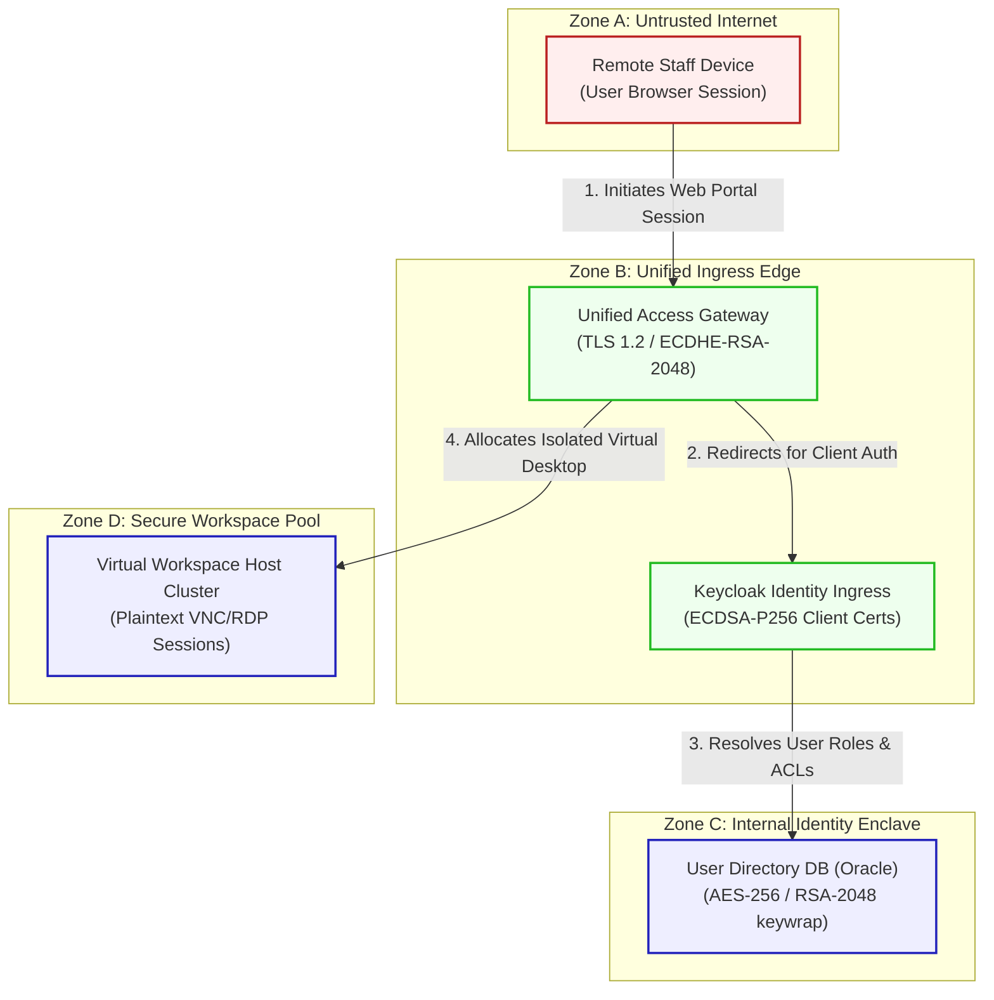

# ShieldDesk Access Architecture And Security Specification

Fictional product: **ShieldDesk Access**
Deployment model: **cloud identity workspace**
Scenario purpose: zero-trust enterprise remote workspace

This document registers the network topology, trust boundaries, and transactional flow for **SecureDesk (Scenario 08)**.

---

## 1. Network Zones & Trust Boundaries

The platform is divided into four security domains to enforce Zero-Trust access:
* **Zone A: Untrusted Internet**: Home/public networks used by remote corporate staff.
* **Zone B: Unified Ingress Edge**: Reverse proxies and gateway nodes verifying incoming requests.
* **Zone C: Internal Identity Enclave**: High-security zone hosting directories and keyvaults.
* **Zone D: Secure Workspace Pool**: Target cluster hosting virtualized desktop instances.

---

## 2. Detailed Architecture Flow Diagram

The following Mermaid flowchart tracks how user sessions flow through the trust boundaries and lists current vulnerable cryptographic controls:

---

## 3. Cryptographic Data Flow Narrative

1. **Remote Connection**: Staff connect from their **Remote Staff Device** over the public internet to the **Unified Access Gateway** via HTTPS channels secured by **TLS 1.2** with ECDHE-RSA ciphers.
2. **Access Control**: The gateway routes credentials to the **Keycloak Identity Ingress**, which processes incoming corporate tokens and validates signatures via classical **ECDSA-P256** client authentication.
3. **Role Resolution**: Keycloak requests access control lists and credentials from the **User Directory DB (Oracle)**, which encrypts accounts at rest using **AES-256** with database keys wrapped via classical **RSA-2048**.
4. **Desktop Allocation**: Upon authentication, the gateway spawns an isolated virtual machine inside the **Virtual Workspace Host Cluster**, serving desktop sessions over internal networks utilizing unencrypted VNC/RDP protocols, creating internal sniffing vulnerabilities.
