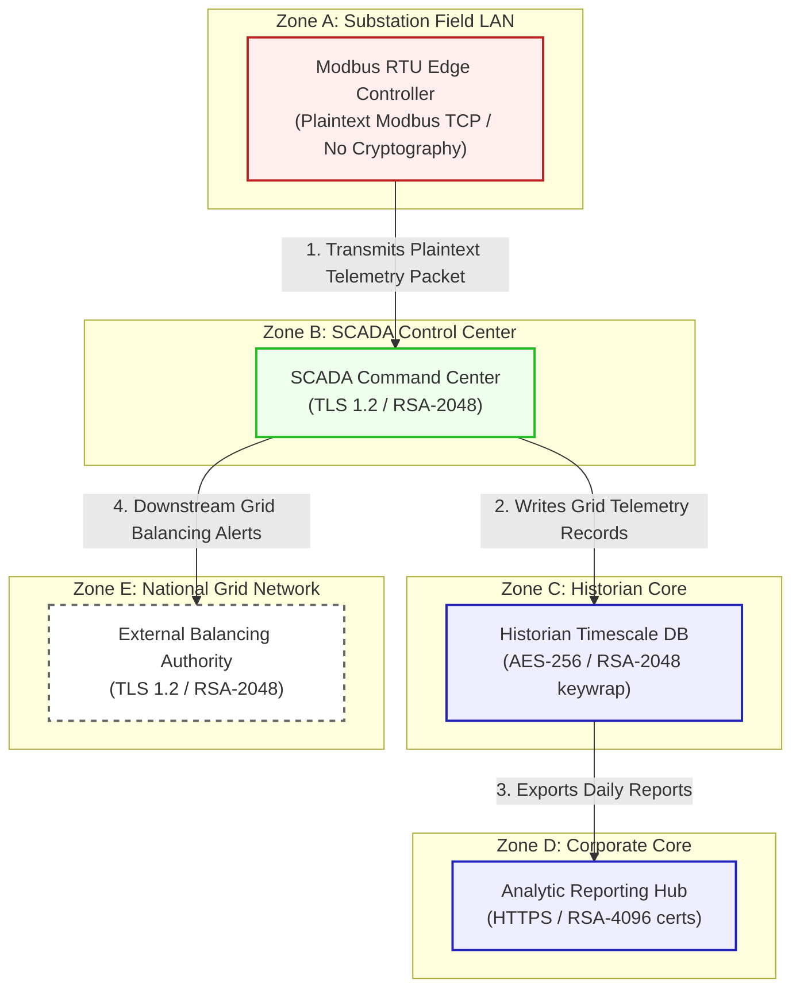

# GridPulse SCADA Architecture And Security Specification

Fictional product: **GridPulse SCADA**
Deployment model: **on-prem OT network**
Scenario purpose: smart grid control and telemetry system

This document registers the network topology, trust boundaries, and transactional flow for **GridPower (Scenario 09)**.

---

## 1. Network Zones & Trust Boundaries

The industrial SCADA estate is structured into four security domains:
* **Zone A: Substation Field LAN**: Highly vulnerable edge networks connecting hardware relays.
* **Zone B: SCADA Control Center**: Centralised operations environment running control nodes.
* **Zone C: Historian Core**: Database zone recording operational telemetry and status histories.
* **Zone D: Corporate Core**: Administrative networks used for analytics and billing.

---

## 2. Detailed Architecture Flow Diagram

The following Mermaid flowchart tracks how grid commands and telemetry flow through the trust boundaries and lists current vulnerable cryptographic controls:

---

## 3. Cryptographic Data Flow Narrative

1. **Substation Telemetry**: The **Modbus RTU Edge Controller** monitors electrical relays and transmits logs over the internal Substation Field LAN utilizing unencrypted **Modbus TCP** ciphers with no cryptographic security, exposing raw grid command sequences.
2. **SCADA Acquisition**: The **SCADA Command Center** acquires grid telemetry via HTTPS ciphers secured by **TLS 1.2** with classical RSA-2048 certificates.
3. **Telemetry Logging**: Grid histories are written into the **Historian Timescale DB**, which encrypts records at rest using **AES-256** with database keys wrapped via classical **RSA-2048**.
4. **Corporate Analytics**: Historical metrics are exported to the **Analytic Reporting Hub** inside the corporate intranet, utilizing HTTPS web connection ciphers secured by classical **RSA-4096** certificates.
5. **Balancing Authority**: The center communicates real-time generation imbalances to the **External Balancing Authority** via API connections running TLS 1.2 with RSA-2048 certificates, leaving telemetry streams exposed to HNDL.
