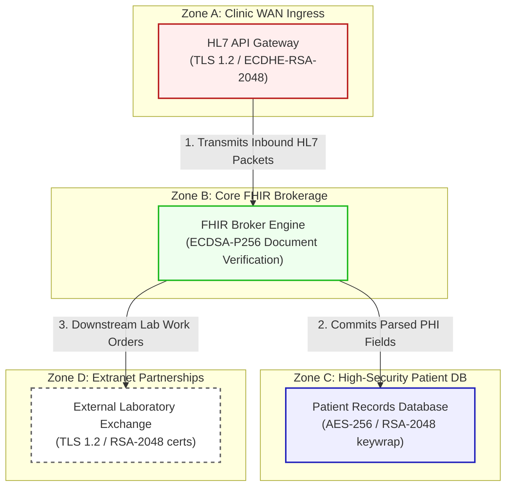

# HealthSync MD Architecture & Network Flow Diagram

This document registers the network topology, trust boundaries, and transactional flow for **HealthSync MD (Scenario 10)**.

---

## 1. Network Zones & Trust Boundaries

The healthcare application comprises four security domains to safeguard patient health information:
* **Zone A: Clinic WAN Ingress**: External WAN interfaces routing incoming clinic connections.
* **Zone B: Core FHIR Brokerage**: Isolated processing environment running HL7 routers.
* **Zone C: High-Security Patient Database**: Enclosed datastore containing Patient Health Information (PHI).
* **Zone D: Extranet Partnerships**: Third-party pharmaceutical and lab exchange routers.

---

## 2. Detailed Architecture Flow Diagram

The following Mermaid flowchart tracks how clinical records flow through the trust boundaries and lists current vulnerable cryptographic controls:

---

## 3. Cryptographic Data Flow Narrative

1. **Clinical Ingress**: Participating clinics transmit electronic patient charts and HL7 payloads to the **HL7 API Gateway** over the WAN. Sessions terminate at the gateway using **TLS 1.2** with ECDHE-RSA certificates.
2. **HL7 Processing**: The gateway passes transactions to the **FHIR Broker Engine**, which parses XML/JSON medical fields and validates signatures using **ECDSA-P256** signatures to ensure non-repudiation.
3. **Database Capture**: Validated patient files are recorded inside the **Patient Records Database**, which encrypts fields at rest using **AES-256** with database keys wrapped via classical **RSA-2048**.
4. **Laboratory Diagnostics**: The engine routes downstream diagnostic requests to the **External Laboratory Exchange** via REST API integrations secured using standard **TLS 1.2** with RSA-2048 web ciphers, exposing sensitive patient records to HNDL.
