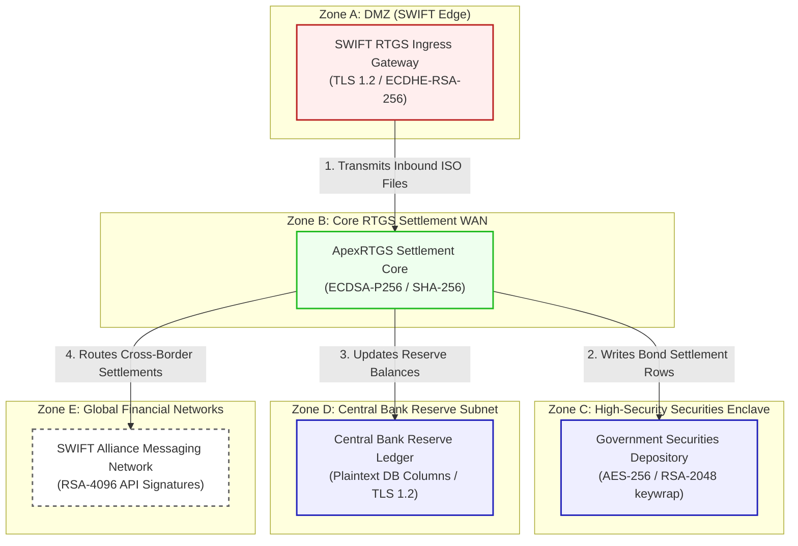

# ApexNet ApexRTGS RTGS Architecture & Network Flow Diagram

This document registers the network topology, trust boundaries, and transactional flow for **ApexNet ApexRTGS (Scenario 11)**.

---

## 1. Network Zones & Trust Boundaries

The high-value clearing estate is segmented into five cryptographic trust zones to enforce maximum resilience:
* **Zone A: Demilitarized Zone (DMZ)**: Highly restricted DMZ terminating partner gateway entries (SWIFT).
* **Zone B: Core RTGS Settlement WAN**: Isolated back-office network coordinating clearing routines.
* **Zone C: High-Security Securities Enclave**: Dedicated database zone storing national debt papers.
* **Zone D: Central Bank Reserve Subnet**: Highly secure internal ledger database hosting bank balances.
* **Zone E: Global Financial Networks**: External connections with international SWIFT clearing services.

---

## 2. Detailed Architecture Flow Diagram

The following Mermaid flowchart tracks how interbank high-value payments flow through the trust boundaries and lists current vulnerable cryptographic controls:

---

## 3. Cryptographic Data Flow Narrative

1. **Transaction Ingress**: Participating member banks submit payment files to the **SWIFT RTGS Ingress Gateway** over secure networks. Connections terminate at the gateway using **TLS 1.2** with ECDHE-RSA ciphers.
2. **Irrevocable Validation**: The gateway forwards records to the **ApexRTGS Settlement Core**, which validates instructions and signs entries using **ECDSA-P256** and SHA-256 signatures to achieve non-repudiation.
3. **Debt Securities Ledger**: For bond transactions, the core writes updates to the **Government Securities Depository**, which encrypts holdings using **AES-256** with database keys wrapped via classical **RSA-2048**.
4. **Reserve Clearing**: Cash debits and credits are recorded on the **Central Bank Reserve Ledger**, which hosts plaintext balance columns and relies solely on TLS 1.2 database connection ciphers, leaving critical reserves exposed.
5. **Cross-Border Remittance**: Downstream foreign currency settlements are routed to the **SWIFT Alliance Messaging Network** via APIs utilizing standard **RSA-4096** signatures, exposing international flows to HNDL.
