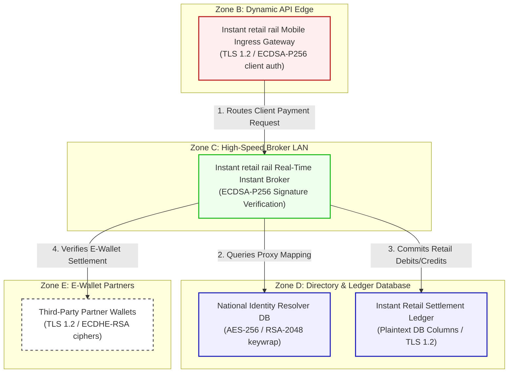

# Anonymous instant retail rail Retail Instant Architecture & Flow Diagram

This document registers the network topology, trust boundaries, and transactional flow for **Anonymous instant retail rail (Scenario 12)**.

---

## 1. Network Zones & Trust Boundaries

The real-time instant payment platform is partitioned into five distinct trust zones:
* **Zone A: Mobile Intranet WAN**: Exposed mobile network endpoints connecting client apps.
* **Zone B: Dynamic API Gateway Edge**: Web DMZ verifying dynamic incoming client certificates.
* **Zone C: High-Speed Broker LAN**: Core backend cluster processing transactions.
* **Zone D: Restricted Directory & Ledger Database**: Enclosed Oracle database engines.
* **Zone E: External E-Wallet Partners**: API integrations with third-party wallets.

---

## 2. Detailed Architecture Flow Diagram

The following Mermaid flowchart tracks how instant retail payment requests flow through the trust boundaries and lists current vulnerable cryptographic controls:

---

## 3. Cryptographic Data Flow Narrative

1. **Mobile Request**: Consumers scan dynamic QR codes or submit mobile transfers, terminating at the **Instant retail rail Mobile Ingress Gateway** via HTTPS with **TLS 1.2** and ECDSA-P256 client authentication.
2. **Transaction Routing**: The gateway forwards payloads to the **Instant retail rail Real-Time Instant Broker**, which validates transaction packets via **ECDSA-P256** and SHA-256 signatures to ensure authenticity.
3. **Proxy Translation**: The broker queries the **National Identity Resolver DB** to map mobile numbers or customer proxy IDs to deposit bank routing. Directory data is encrypted at rest using **AES-256** with database keys wrapped via classical **RSA-2048**.
4. **Ledger Balancing**: Instant interbank net balances are updated on the **Instant Retail Settlement Ledger**, which contains plaintext database fields secured only by TLS 1.2 database connection ciphers.
5. **E-Wallet Release**: Downstream confirmations are routed to **Third-Party Partner Wallets** (e.g., GrabPay) via REST APIs running TLS 1.2 with ECDHE-RSA ciphers, exposing transaction parameters to HNDL threats.
