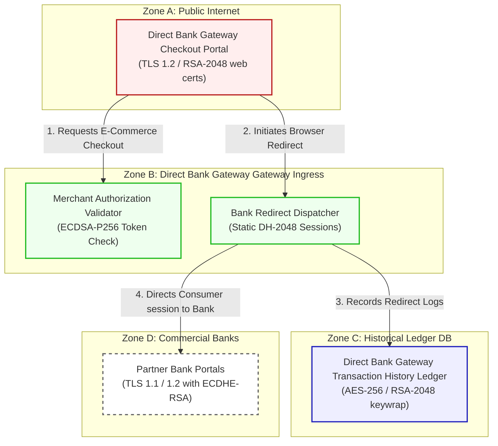

# Anonymous network operator Direct Bank Gateway E-Commerce Architecture & Flow Diagram

This document registers the network topology, trust boundaries, and transactional flow for **Anonymous network operator Direct Bank Gateway (Scenario 13)**.

---

## 1. Network Zones & Trust Boundaries

The direct-to-bank web payment network comprises four security domains:
* **Zone A: Public Internet**: Browser environments where consumers initiate transactions.
* **Zone B: Direct Bank Gateway Core Gateway Ingress**: Web DMZ terminating public e-commerce connections.
* **Zone C: Internal Processing Enclave**: Secure network running redirection and token engines.
* **Zone D: Historical Ledger DB**: Secured database archiving transaction histories.

---

## 2. Detailed Architecture Flow Diagram

The following Mermaid flowchart tracks how online checkouts and bank redirections flow through the trust boundaries and lists current vulnerable cryptographic controls:

---

## 3. Cryptographic Data Flow Narrative

1. **Merchant Ingress**: Consumers select payment options, routing browser queries to the **Direct Bank Gateway Checkout Portal** via HTTPS secured by **TLS 1.2** with classical RSA-2048 certificates.
2. **Signature Verification**: The portal requests transaction validation from the **Merchant Authorization Validator**, which validates merchant tokens and parameters using classical **ECDSA-P256** signatures.
3. **Session Dispatch**: Redirection session coordinates are generated by the **Bank Redirect Dispatcher**, utilizing browser session parameters negotiated via static **Diffie-Hellman (DH-2048)** keys.
4. **Audit Logging**: Redirection tracking metrics and payment references are archived on the **Direct Bank Gateway Transaction History Ledger**, which encrypts records at rest using **AES-256** with database keys wrapped via classical **RSA-2048**.
5. **Bank Redirection**: The dispatcher directs consumer browser sessions to **Partner Bank Portals** via redirects using legacy **TLS 1.1 / 1.2** with ECDHE-RSA ciphers, exposing sensitive redirect payloads to active sniffing.
