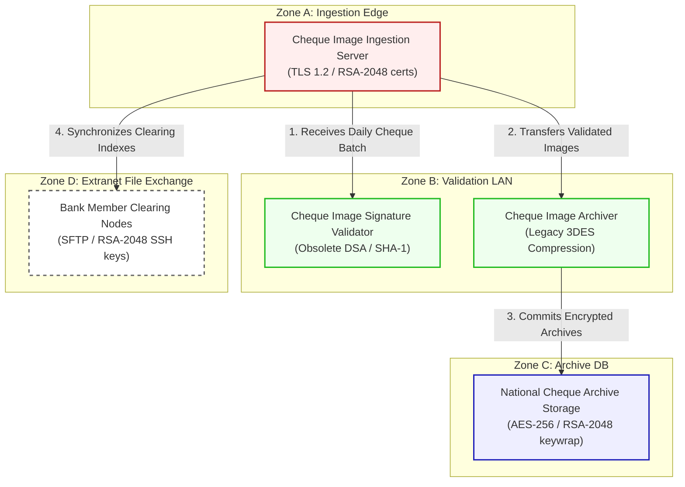

# ApexNet ChequeClear Cheque Clearing Architecture & Flow Diagram

This document registers the network topology, trust boundaries, and transactional flow for **ApexNet ChequeClear (Scenario 14)**.

---

## 1. Network Zones & Trust Boundaries

The electronic cheque clearing system is segmented into four distinct trust domains:
* **Zone A: Ingestion Edge**: Gateway terminating corporate uploads from banking partners.
* **Zone B: Clearing Validation Subnet**: Internal core validating batch XML and signatures.
* **Zone C: Long-Term Archive Database**: Restricted database archiving image holdings.
* **Zone D: Extranet File Exchange**: Batch SFTP nodes connecting bank member clearinghouses.

---

## 2. Detailed Architecture Flow Diagram

The following Mermaid flowchart tracks how daily cheque presentment batches flow through the trust boundaries and lists current vulnerable cryptographic controls:

---

## 3. Cryptographic Data Flow Narrative

1. **Batch Upload**: Bank administrators upload zip packages containing scanned cheque images to the **Cheque Image Ingestion Server** via HTTPS ciphers secured by **TLS 1.2** with RSA-2048 certificates.
2. **Signature Check**: The ingestion server routes files to the **Cheque Image Signature Validator**, which checks non-repudiation and package integrity using obsolete **DSA and SHA-1** signatures, presenting critical security exposure.
3. **Bulk Archival**: Validated cheque images are routed to the **Cheque Image Archiver**, which compresses and encrypts the batch zip files leveraging legacy **3DES** ciphers.
4. **Historical Storage**: Encrypted files are saved to the **National Cheque Archive Storage**, which encrypts records at rest using **AES-256** with database keys wrapped via classical **RSA-2048**.
5. **Bank Integration**: The ingestion server syncs transactional indexes with **Bank Member Clearing Nodes** via automated SFTP transfers utilizing static **RSA-2048 SSH** keys, leaving file directories vulnerable to HNDL.
