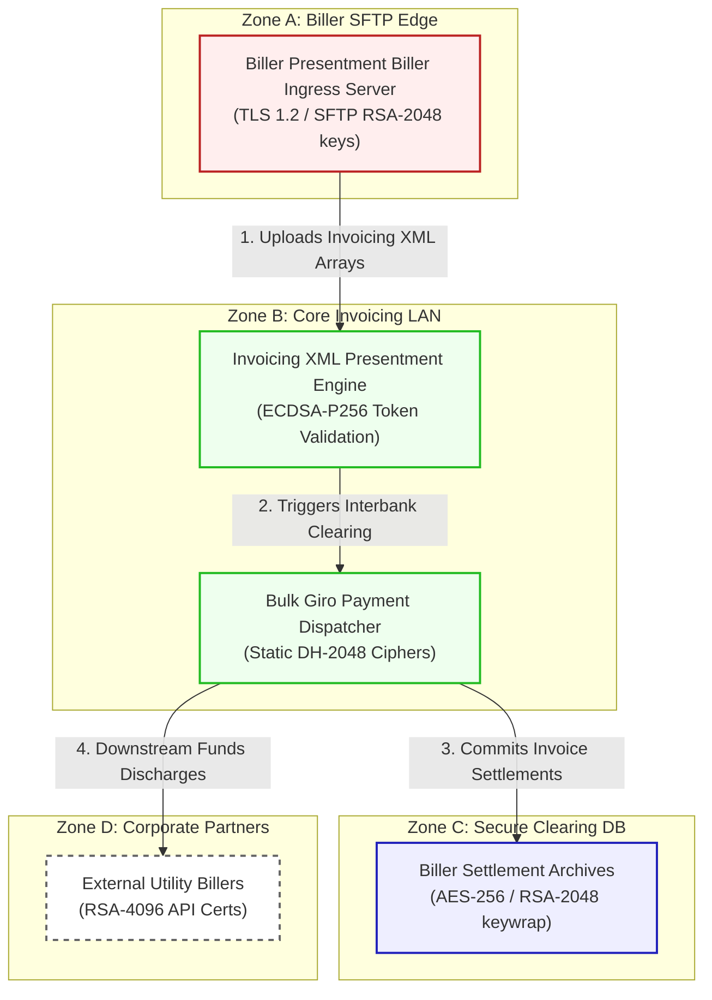

# InvoiceNet Presentment Architecture And Security Specification

Fictional product: **InvoiceNet Presentment**
Deployment model: **hybrid bill presentment**
Scenario purpose: bulk bill presentment and settlement scheduler

This document registers the network topology, trust boundaries, and transactional flow for **InvoiceNet Presentment Biller Presentment (Scenario 15)**.

---

## 1. Network Zones & Trust Boundaries

The bill presentment and clearing system is structured into four security domains:
* **Zone A: Biller SFTP Edge**: Gateway terminating batch invoice uploads from corporate billers.
* **Zone B: Core Invoicing Subnet**: Internal processing LAN running XML parsers and schedulers.
* **Zone C: Secure Clearing Database**: REST/Oracle database holding biller registries.
* **Zone D: Corporate Partners**: Third-party utilities receiving daily settlement transfers.

---

## 2. Detailed Architecture Flow Diagram

The following Mermaid flowchart tracks how corporate invoice files and GIRO payments flow through the trust boundaries and lists current vulnerable cryptographic controls:

---

## 3. Cryptographic Data Flow Narrative

1. **Invoicing Upload**: Corporate billers upload daily presentment invoices to the **Biller Presentment Biller Ingress Server** over SFTP connection ciphers secured by static **RSA-2048 SSH** keys.
2. **Presentment Processing**: The ingress server routes files to the **Invoicing XML Presentment Engine**, which checks invoice records and validates merchant token signatures via classical **ECDSA-P256** signatures.
3. **GIRO Schedulers**: Validated billing batches are forwarded to the **Bulk Giro Payment Dispatcher**, which initiates Interbank GIRO (IBG) settlements utilizing connection ciphers secured via static **Diffie-Hellman (DH-2048)** keys.
4. **Archive Preservation**: Invoicing balances and corporate registration tables are saved to the **Biller Settlement Archives**, which encrypts records at rest using **AES-256** with database keys wrapped via classical **RSA-2048**.
5. **Corporate Discharges**: The dispatcher triggers downstream payouts to **External Utility Billers** (e.g., Telecom the region) via REST APIs running TLS 1.2 utilizing standard **RSA-4096** certificates, leaving clearing databases vulnerable to HNDL.
