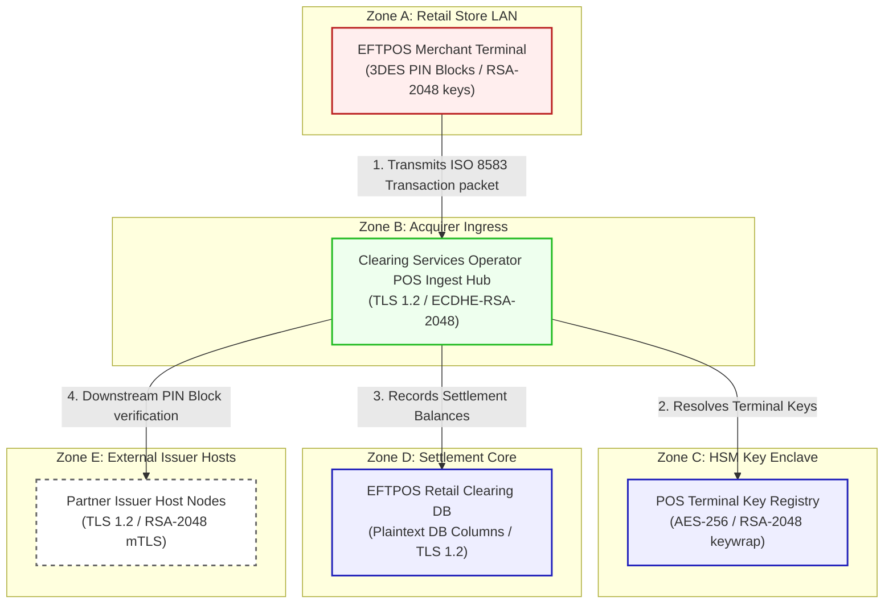

# POSLink Acquire Architecture And Security Specification

Fictional product: **POSLink Acquire**
Deployment model: **hybrid acquiring network**
Scenario purpose: point-of-sale debit acquiring hub

This document registers the network topology, trust boundaries, and transactional flow for **Retail POS Network (Scenario 16)**.

---

## 1. Network Zones & Trust Boundaries

The card acquisition network comprises five security domains:
* **Zone A: Retail Merchant LAN**: Intranet boundaries inside brick-and-mortar retail stores.
* **Zone B: Acquirer Ingress Hub**: Security DMZ terminating external merchant terminal requests.
* **Zone C: HSM & Key Enclave**: Highly restricted zone storing merchant master keys.
* **Zone D: Acquirer Settlement Core**: Database zone capturing transactions and net balances.
* **Zone E: External Issuer Hosts**: Interbank networks connecting participant consumer banks.

---

## 2. Detailed Architecture Flow Diagram

The following Mermaid flowchart tracks how card-present transactions and PIN blocks flow through the trust boundaries and lists current vulnerable cryptographic controls:

---

## 3. Cryptographic Data Flow Narrative

1. **Card Acquisition**: Consumers insert or tap cards, triggering the **EFTPOS Merchant Terminal** to capture credentials, encrypt PIN blocks via legacy **3DES (ANSI X9.8)**, and encrypt session keys using classical **RSA-2048** key transport ciphers.
2. **Gateway Ingress**: Terminal packets are transmitted to the **Clearing Services Operator POS Ingest Hub** via HTTPS connections secured by **TLS 1.2** with ECDHE-RSA certificates.
3. **Key Retrieval**: The hub retrieves active terminal keys from the **POS Terminal Key Registry** to decrypt ISO 8583 PIN blocks, utilizing **AES-256** transparent table ciphers with keys wrapped via classical **RSA-2048**.
4. **Clearing Capture**: Captured settlement sequences and card numbers are saved on the **EFTPOS Retail Clearing DB**, which hosts plaintext columns secured only by TLS 1.2 database connections.
5. **Issuer Verification**: Ingress nodes forward ISO packets to **Partner Issuer Host Nodes** (e.g., Bank A Bank) via host-to-host mTLS ciphers secured by standard **TLS 1.2** with RSA-2048 certificates, leaving card PIN blocks exposed to HNDL.
