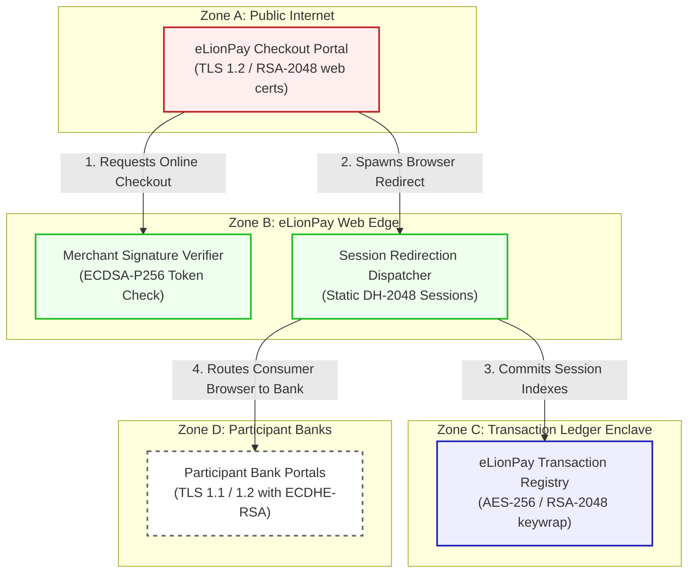

# eLionPay E-Commerce Web Architecture & Flow Diagram

This document registers the network topology, trust boundaries, and transactional flow for **eLionPay Online Payment Gateway (Scenario 17)**.

---

## 1. Network Zones & Trust Boundaries

The web-based bank gateway consists of four distinct trust zones:
* **Zone A: Public Internet**: Retail browsers where consumers select payment modes.
* **Zone B: eLionPay Core Web Edge**: DMZ reverse proxies terminating public internet checkouts.
* **Zone C: Transaction Processing Core**: Highly secured LAN running redirection engines.
* **Zone D: Transaction Ledger Enclave**: Database hosting active transaction records.

---

## 2. Detailed Architecture Flow Diagram

The following Mermaid flowchart tracks how online checkouts and bank redirects flow through the trust boundaries and lists current vulnerable cryptographic controls:

---

## 3. Cryptographic Data Flow Narrative

1. **Checkout Initiation**: Consumers select online banking payment options, initiating browser communication to the **eLionPay Checkout Portal** via HTTPS ciphers secured by **TLS 1.2** with classical RSA-2048 certificates.
2. **Merchant Verification**: The gateway forwards records to the **Merchant Signature Verifier**, which parses transaction tokens and validates signature authenticity using classical **ECDSA-P256** ciphers.
3. **Redirection Coordination**: Session redirect parameters are generated by the **Session Redirection Dispatcher**, utilizing browser parameters negotiated via static **Diffie-Hellman (DH-2048)** keys.
4. **Archival Logs**: Redirection parameters, times, and transaction tokens are saved to the **eLionPay Transaction Registry**, which encrypts records at rest using **AES-256** with database keys wrapped via classical **RSA-2048**.
5. **Bank Redirection**: The dispatcher directs consumer browser sessions to **Participant Bank Portals** via redirects using legacy **TLS 1.1 / 1.2** with ECDHE-RSA ciphers, exposing sensitive redirect payloads to active sniffing.
