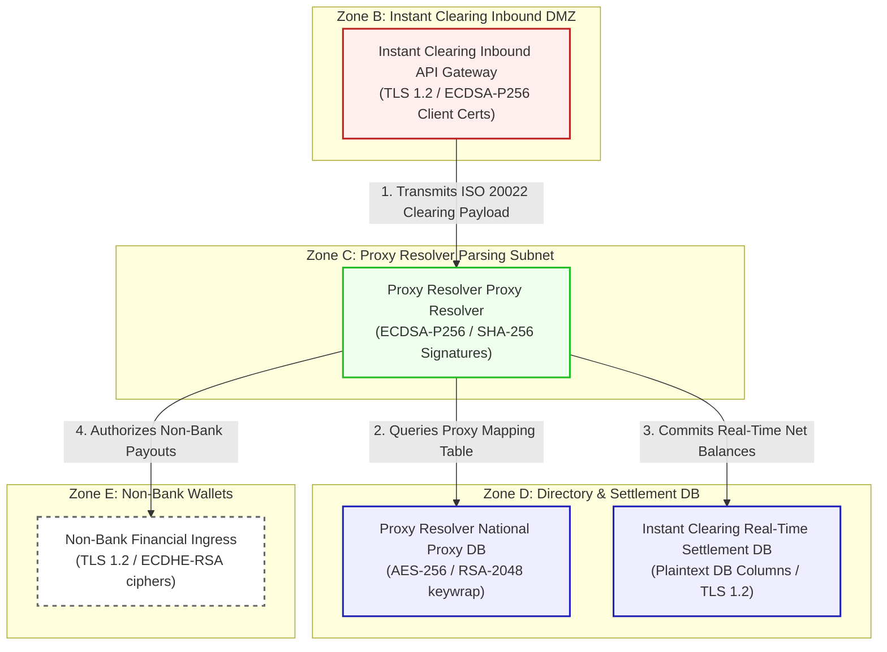

# Instant clearing rail Clearing & Proxy Resolver Core Architecture & Flow Diagram

This document registers the network topology, trust boundaries, and transactional flow for **Instant clearing rail Clearing & Proxy Resolver Core (Scenario 18)**.

---

## 1. Network Zones & Trust Boundaries

The real-time instant clearing engine is partitioned into five distinct trust domains:
* **Zone A: Interbank WAN**: Highly secure WAN connecting participant clearing banks.
* **Zone B: Instant Clearing Inbound DMZ**: Security edge gateway terminating bank connections.
* **Zone C: Proxy Resolver Parsing Subnet**: Internal processing LAN running proxy resolvers.
* **Zone D: Restricted Directory & Settlement Database**: Secure Oracle database engines.
* **Zone E: External Non-Bank Wallets**: REST API integrations connecting e-wallet providers.

---

## 2. Detailed Architecture Flow Diagram

The following Mermaid flowchart tracks how instant interbank payments and proxy queries flow through the trust boundaries and lists current vulnerable cryptographic controls:

---

## 3. Cryptographic Data Flow Narrative

1. **Transaction Inbound**: Participant banks transmit real-time ISO 20022 clearing payloads to the **Instant Clearing Inbound API Gateway** over the Interbank WAN, terminating via HTTPS secured by **TLS 1.2** with ECDSA-P256 client certificates.
2. **Payload Parsing**: The gateway routes clearing files to the **Proxy Resolver Proxy Resolver**, which validates payment payload parameters using classical **ECDSA-P256** and SHA-256 signatures to ensure authenticity.
3. **Proxy Directory Resolution**: The resolver queries the **Proxy Resolver National Proxy DB** to translate mobile numbers or business proxy ID business numbers to bank account numbers. Directory data is encrypted at rest using **AES-256** with database keys wrapped via classical **RSA-2048**.
4. **Settlement Logging**: Real-time funds debits/credits are committed to the **Instant Clearing Real-Time Settlement DB**, which hosts plaintext columns secured only by TLS 1.2 database connection ciphers.
5. **Non-Bank Integration**: Instant confirmations are sent to **Non-Bank Financial Ingress** e-wallets (e.g., GrabPay) via REST APIs running TLS 1.2 with ECDHE-RSA ciphers, exposing sensitive transaction details to HNDL threats.
