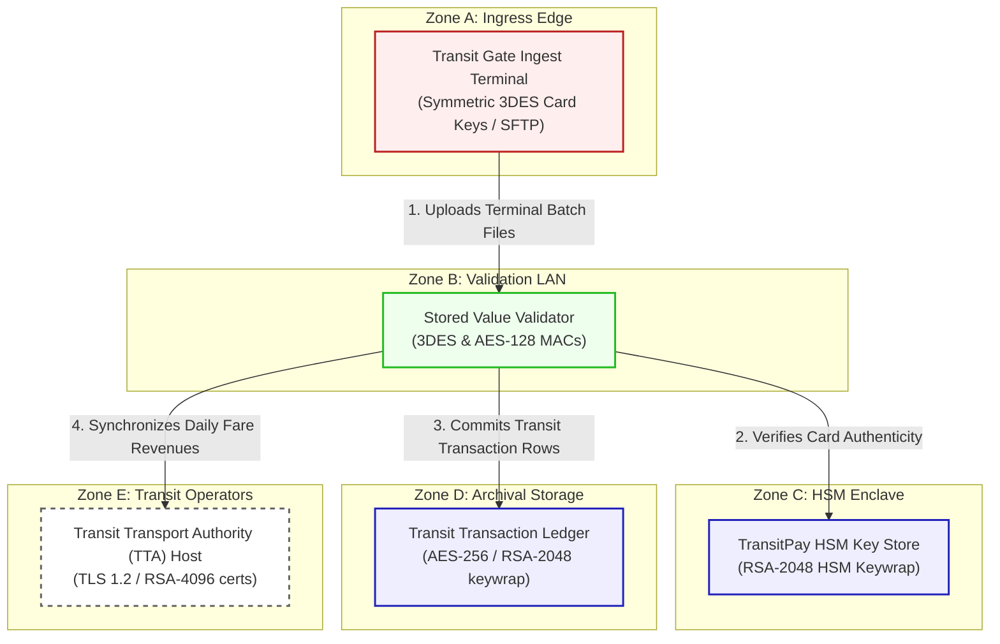

# TransitPay Contactless Transit Architecture & Flow Diagram

This document registers the network topology, trust boundaries, and transactional flow for **TransitPay & Motoring Card (Scenario 19)**.

---

## 1. Network Zones & Trust Boundaries

The contactless stored-value card settlement platform is partitioned into five distinct trust domains:
* **Zone A: Transport Ingress Edge**: Highly vulnerable physical gates and gantries reading cards.
* **Zone B: Clearing Validation LAN**: Isolated processing subnet running balance verifiers.
* **Zone C: High-Security Cryptographic HSM Enclave**: Restrictive vault housing master keys.
* **Zone D: Archival Storage Subnet**: Database capturing daily transit transaction logs.
* **Zone E: External Transit Operators**: Clearing integrations with transport authorities (TTA).

---

## 2. Detailed Architecture Flow Diagram

The following Mermaid flowchart tracks how transit smartcard taps and daily batch uploads flow through the trust boundaries and lists current vulnerable cryptographic controls:

---

## 3. Cryptographic Data Flow Narrative

1. **Card Presentation**: Cardholders tap smartcards at transit gantries, initiating microsecond chip handshakes utilizing symmetric **3DES keys** to deduct funds. Gantries write logs and upload daily transaction zip files to the **Transit Gate Ingest Terminal** over SFTP connection ciphers secured by static **RSA-2048 SSH** keys.
2. **Balance Validation**: The terminal routes files to the **Stored Value Validator**, which verifies transaction counts and card signatures using symmetric **3DES and AES-128 MAC** ciphers.
3. **Key Retrieval**: The validator requests card key derivation indexes from the **TransitPay HSM Key Store**, which hosts terminal master keys wrapped via classical **RSA-2048** key transport ciphers.
4. **Historical Archival**: Cleared travel records and card numbers are saved on the **Transit Transaction Ledger**, which encrypts records at rest using **AES-256** with database keys wrapped via classical **RSA-2048**.
5. **Transport Reconciliation**: The settlement engine synchronizes revenue distributions with the **Transit Transport Authority (TTA) Host** via REST APIs secured by standard **TLS 1.2** with RSA-4096 web ciphers, exposing transit travel records to HNDL threats.
