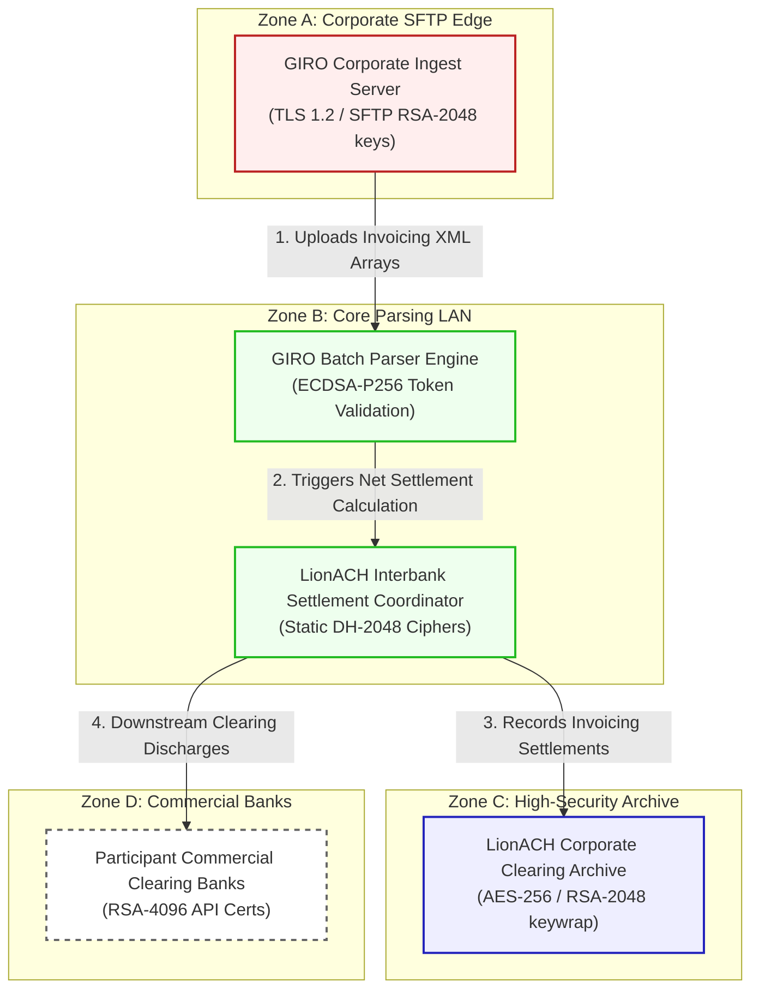

# Singapore Automated Clearing House (LionACH) GIRO Architecture & Flow Diagram

This document registers the network topology, trust boundaries, and transactional flow for **Singapore Automated Clearing House (LionACH) GIRO Clearing (Scenario 20)**.

---

## 1. Network Zones & Trust Boundaries

The bulk interbank clearing engine is partitioned into four distinct trust zones:
* **Zone A: Corporate SFTP Edge**: Gateway terminating batch uploads from corporate banking clients.
* **Zone B: Core Parsing & Processing LAN**: Secure back-office network hosting parsing tools.
* **Zone C: LionACH High-Security Archive**: Enclosed Oracle DB cluster storing financial histories.
* **Zone D: Commercial Clearing Banks**: Partner interfaces connecting clearing banks.

---

## 2. Detailed Architecture Flow Diagram

The following Mermaid flowchart tracks how daily bulk GIRO invoicing batches and payroll clearances flow through the trust boundaries and lists current vulnerable cryptographic controls:

---

## 3. Cryptographic Data Flow Narrative

1. **Invoicing Upload**: Corporate clients and government billing portals upload daily payroll/invoice batches to the **GIRO Corporate Ingest Server** over SFTP connection ciphers secured by static **RSA-2048 SSH** keys.
2. **Presentment Parsing**: The ingress server routes records to the **GIRO Batch Parser Engine**, which verifies batch files and validates invoice tokens via classical **ECDSA-P256** signatures to check integrity.
3. **GIRO Schedulers**: Validated billing batches are forwarded to the **LionACH Interbank Settlement Coordinator**, which schedules interbank net settlements utilizing connection ciphers secured via static **Diffie-Hellman (DH-2048)** keys.
4. **Archive Preservation**: Invoicing balances and corporate registration tables are saved to the **LionACH Corporate Clearing Archive**, which encrypts records at rest using **AES-256** with database keys wrapped via classical **RSA-2048**.
5. **Bank Discharges**: The coordinator triggers daily clearing reports and downstream funds transfers to **Participant Commercial Clearing Banks** (e.g., DBS Bank) via REST APIs running TLS 1.2 utilizing standard **RSA-4096** certificates, leaving clearing transactions exposed to HNDL.
